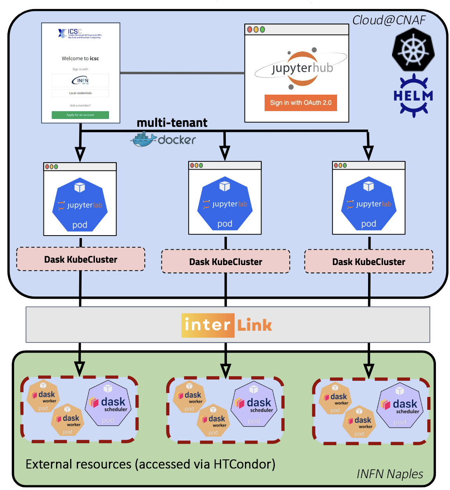

# Infrastructure Details
The infrastructure consists of a k8s cluster with:
- Master node with 16 CPUs, 32 GB RAM, 80 GB disk
- 7 worker nodes with 16 CPUs, 32 GB RAM, 80 GB disk

On such cluster, a JupyterHub is deployed where the users can deploy a JupyterLab session to get access to a full IDE (persistent storage, terminal, notebooks, editors, ...).

[**July 2025**] Users can now scale up their computation, using Dask, by offloading to external resources:

- 5 dedicated nodes (each one with 96 cores).
- *More nodes will be added in the next weeks...*

These nodes are accessible via HTCondor-CE and the connection is totally transparent for the user (using the [InterLink](https://www.intertwin.eu/article/infrastructure-component-interlink) service).

Below a simplified diagram of the High Rate platform:

